# EEG Seizure Detection from Multichannel Scalp EEG

Patient-specific seizure-event detection on the public CHB-MIT scalp EEG dataset, combining signal processing, classical machine learning, event-level evaluation, deployment-feasibility analysis, and a five-stage clinical error-analysis loop.

**Project:** UCC EE6019 Research Report  
**Author:** Yangdeyi Yang  
**Engineering showcase:** https://derekamethy.github.io/EEG-seizure-detection-website/

> This repository is a cleaned public release. The original research files are preserved separately and are never modified by the release-building workflow.

## What the system does

```mermaid
flowchart LR
    A[CHB-MIT EDF + annotations] --> B[22-channel bipolar alignment]
    B --> C[0.5-50 Hz Butterworth filtering]
    C --> D[Non-overlapping 2 s epochs]
    D --> E[443 spectral + synchrony features]
    E --> F[4-frame temporal stack: 1772 candidates]
    F --> G[Fold-local top-30 feature selection]
    G --> H[Patient-specific 500-tree Random Forest]
    H --> I[Median smoothing + validation threshold + duration rule]
    I --> J[Event sensitivity / FAR / delay]
    J --> K[Clinical error analysis v1-v5]
```



## Canonical study scope and headline results

The reported study used `chb01`-`chb10`: **580.57 hours** of retrospective EEG and **55 annotated seizure events**. Evaluation was patient-specific and within-subject, using file-level leave-one-seizure-out logic. It was not unseen-patient generalisation.

| Metric | Reported value | Aggregation |
| --- | ---: | --- |
| Event sensitivity | 0.98 | Macro across subjects |
| False-alarm rate | 0.2455 / h | Median across subjects |
| Detection delay | 10.64 s | Reported mean for detected events |
| Seizures detected | 53 / 55 | Pooled cohort count |

Different aggregation conventions are intentionally kept separate. Machine-readable versions are in [`results/headline_metrics.csv`](results/headline_metrics.csv), [`results/model_benchmark.csv`](results/model_benchmark.csv), and [`results/feature_reduction_comparison.csv`](results/feature_reduction_comparison.csv).


## What I implemented

The canonical notebook contains the complete signal-to-event path: EDF ingestion, annotation parsing, reversed-polarity channel handling, filtering, epoch labelling, frequency-band and synchrony features, temporal context, fold-local feature selection, SVM/RF/XGBoost comparisons, threshold selection, event metrics, latency profiling, model-size analysis, patient-specific model export, and C-export feasibility work.

The final selected classifier used **30 selected inputs, 500 trees, maximum depth 12**, and patient-specific validation-selected thresholds. A separate lightweight branch studied compression trade-offs rather than redefining the headline model.


## Clinical error analysis: v1-v5

The clinical branch is part of the reported project work, even though it was developed in separate notebooks rather than merged back into the large canonical notebook. It moves from aggregate scores to event-level failure modes and then uses those failures to drive controlled iterations.

| Stage | Main question | Outcome |
| --- | --- | --- |
| v1 | Why are `chb04` detections late and `chb08` false alarms high? | Established event-level failure modes |
| v2 | Which component of the first targeted fix actually helps? | Proxy augmentation passed the global guard |
| v3 | Can a smaller proxy subset retain the benefit? | Full proxy stack remained the accepted variant |
| v4 | Can a minimal add-back recover the difficult `chb04` event? | Sensitivity recovered but delay worsened |
| v5 | Can timing policy reduce delay without exploding FAR? | Earlier alarms came with unacceptable FAR growth |

The strongest guard-passing result in this branch was `proxy_augmented_rf`, which preserved macro sensitivity at **0.9778** while reducing the clinical-branch macro FAR from **0.3907/h to 0.2575/h** and mean delay from **9.96 s to 9.42 s**. Later v4-v5 iterations are retained because their negative results narrow the design space rather than being hidden.

See [`clinical_error_analysis/README.md`](clinical_error_analysis/README.md) for the full v1-v5 lineage and [`clinical_error_analysis/results/v5/`](clinical_error_analysis/results/v5/) for the final exported evidence package.

## Repository structure

```text
src/eeg_seizure_detection/   Stable public API over the canonical implementation
notebooks/canonical/          Final RF pipeline and the 1D-CNN add-on notebook
clinical_error_analysis/     v1-v5 notebooks, reports and exported evidence
configs/final_rf.json         Human-readable final RF configuration
results/                      Canonical reported-result tables with aggregation labels
assets/                       Key comparison and feature-importance figures
data/                         Dataset access and redistribution notes
docs/                         Release audit and public documentation
scripts/                      Extraction, QA and reproduction utilities
```

`legacy_core.py` is generated from the canonical final notebook. The smaller modules (`data.py`, `features.py`, `models.py`, `evaluation.py`, etc.) re-export that implementation by responsibility instead of maintaining a second copy of the algorithms.

## Reproduction entry point

Create an isolated Python environment, install the dependencies, obtain CHB-MIT through its authorised source, then provide the dataset root explicitly:

```bash
python -m pip install -e .
python scripts/check_release.py
python scripts/run_final_rf.py --data-root /path/to/chb-mit --rebuild-cache
```

The reproduction command writes a new patient-summary CSV under `outputs/`; it does not modify the historical notebooks or reported result files.

## Scientific and engineering boundaries

This is an academic retrospective research prototype, not a medical device or clinical validation study. The main evaluation is within-subject and patient-specific. The canonical zero-phase filter and centred probability smoother are offline/non-causal; a streaming implementation would require causal replacements and renewed validation. Reported latency was measured in the Python notebook environment rather than on target embedded hardware.

The separate deep-learning/domain-generalisation rebuild is intentionally excluded from this repository because it was exploratory and did not contribute validated real-data results to the reported EE6019 project.

## Release integrity

The public-release workflow never edits or deletes the original EE6019 research directory. All cleaning, path sanitisation, restructuring and documentation are performed inside the separate `github_release` working copy. `scripts/check_release.py` verifies repository structure, Python syntax, notebook JSON validity, local-user-path leakage, the presence of all five clinical-error notebooks, and exclusion of the exploratory DL/DG rebuild.

The full academic report is temporarily omitted from the public branch while a privacy-redacted copy is prepared. The scientific results represented in this repository are cross-checked against that final report. See [`docs/PROJECT_AUDIT.md`](docs/PROJECT_AUDIT.md) for release provenance and claim boundaries.

## Licensing and data

Source code and release tooling authored for this repository are provided under the MIT License. Third-party datasets, reproduced literature figures, and externally owned material retain their original rights and terms. Raw CHB-MIT EDF recordings are not redistributed here; see [`data/README.md`](data/README.md).
