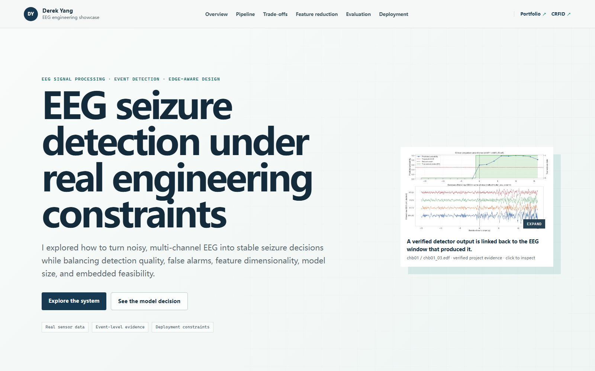
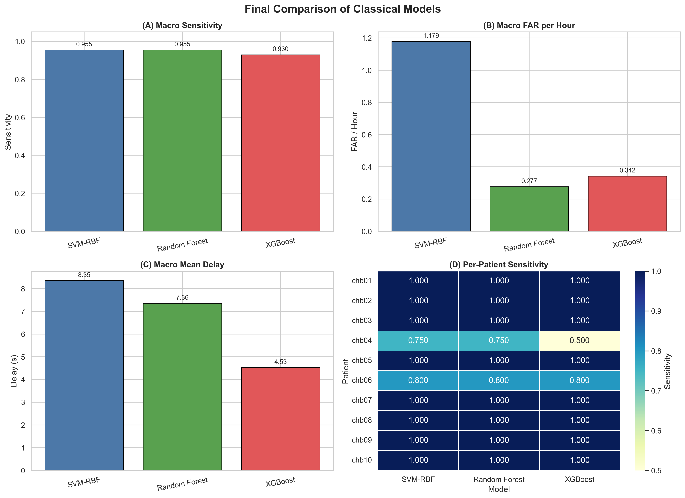
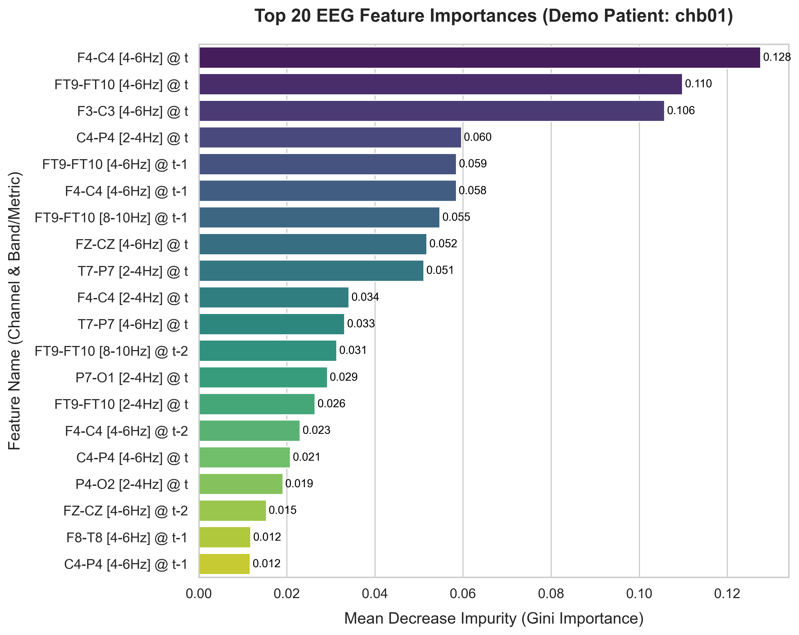

# EEG Seizure Detection from Multichannel Scalp EEG

Patient-specific seizure-event detection on the public CHB-MIT scalp EEG dataset, combining signal processing, classical machine learning, leakage-aware validation, event-level error analysis, and deployment-oriented profiling.

[](https://github.com/Derekamethy/eeg-seizure-detection/actions/workflows/release-qa.yml)

**UCC EE6019 Research Project · Yangdeyi Yang**

[Engineering showcase](https://derekamethy.github.io/EEG-seizure-detection-website/) · [Privacy-redacted final report](docs/EE6019_Final_Report_PUBLIC_REDACTED.pdf) · [RF reference notebook](notebooks/reference/01_final_rf_reference.ipynb) · [Error-analysis lineage](clinical_error_analysis/)

[](https://derekamethy.github.io/EEG-seizure-detection-website/)

> Academic retrospective research prototype. It is not a medical device, prospective clinical study, or unseen-patient generalisation system.

## At a glance

| Study scope | Result |
| --- | ---: |
| Patients | 10 (`chb01`-`chb10`) |
| Retrospective EEG | 580.57 h |
| Annotated seizure events | 55 |
| Detected events | 53 / 55 |
| Macro event sensitivity | 0.98 |
| Median subject FAR | 0.2455 events/h |
| Mean delay among detected events | 10.64 s |

**Core strengths:** EEG/DSP · feature engineering · classical ML · leakage-aware validation · event-level metrics · error analysis · model-size/latency profiling

## Why this problem matters

A useful seizure detector cannot be judged by epoch accuracy alone. In long EEG recordings, a model can look accurate while still producing too many false alarms, detecting seizures too late, or overfitting to patient-specific patterns.

This project therefore treats seizure detection as a **signal-processing and event-detection problem**, not only a binary-classification problem. The design target is a practical balance between:

- detecting as many seizure events as possible;
- controlling false alarms over many hours of non-seizure EEG;
- keeping detection delay interpretable;
- preventing leakage between feature selection, threshold tuning, and held-out evaluation;
- understanding whether the final model is small and fast enough to motivate embedded follow-up work.

## My contribution

I designed and implemented the end-to-end research workflow rather than only training a classifier. The main contributions are:

1. **Built the EEG preprocessing path** from EDF ingestion and annotation parsing through 22-channel bipolar alignment, reversed-polarity handling, filtering, and 2 s epoch labelling.
2. **Designed a compact engineered representation** with 440 spectral-band features plus three synchrony features, then added three previous epochs of temporal context to form 1,772 candidate inputs.
3. **Implemented leakage-aware model selection**, including fold-local feature ranking, patient-specific validation thresholds, and held-out event evaluation.
4. **Compared classical model families** and selected Random Forest for the reported system before tuning the final Top-30 / 500-tree configuration.
5. **Evaluated event-level detector behaviour** using seizure sensitivity, false alarms per hour, and detection delay rather than relying on sample-level accuracy.
6. **Performed the reported v1-v5 error-analysis loop**, diagnosing delayed detections and false-positive-heavy cases, testing targeted changes, and rejecting changes that improved focus cases but failed the cohort-level guard.
7. **Profiled deployment feasibility**, including model size, Python inference latency, compact-forest trade-offs, and C-export feasibility without claiming target-hardware performance.

## System architecture

The pipeline is grouped into five stages so the full system is readable at normal GitHub zoom without an interactive diagram.

| Stage | Processing path | Output / purpose |
| --- | --- | --- |
| **1 · Data & channels** | CHB-MIT EDF + annotations → 22-channel bipolar alignment | Standardised multichannel EEG with consistent channel order and polarity |
| **2 · Preprocessing** | 0.5–50 Hz Butterworth filtering → non-overlapping 2 s epochs | Labelled EEG windows for feature extraction |
| **3 · Feature engineering** | 443 spectral + synchrony features → 4-frame temporal stack (1,772 candidates) → fold-local Top-30 selection | Compact, leakage-aware representation for each outer evaluation fold |
| **4 · Model & decision logic** | Patient-specific 500-tree Random Forest → probability smoothing → validation-selected threshold → duration rule | Sustained event decisions rather than isolated positive windows |
| **5 · Evaluation & refinement** | Event sensitivity / FAR / delay → v1-v5 error analysis → cohort-level guard | Evidence-driven iteration with rejected regressions kept visible |

The key separation is deliberate: **feature selection and threshold tuning happen inside training/validation data, while the held-out outer evaluation remains untouched until scoring.**

## Engineering decisions

| Decision | Why it was used | Trade-off / boundary |
| --- | --- | --- |
| 2 s non-overlapping epochs | Keeps temporal units simple and supports event-level post-processing | Coarser timing than shorter windows |
| Spectral + synchrony features | Provides interpretable EEG structure without a large end-to-end network | Requires handcrafted feature computation |
| Three previous epochs of context | Adds short-term temporal information to a classical model | Expands 443 base features to 1,772 candidates |
| Fold-local Top-30 selection | Reduces dimensionality while keeping selection inside the training fold | Top features can vary by patient/fold |
| Random Forest | Strong sensitivity/FAR balance, interpretable feature importance, export/profiling path | Larger than a tiny embedded classifier |
| Validation-selected threshold | Adapts operating point per patient without tuning on the held-out test fold | Remains patient-specific |
| Event-level metrics | Reflects seizure misses, false alarms and delay directly | Not directly comparable with sample-level accuracy |
| Zero-phase filtering / centred smoothing | Appropriate for the retrospective study and clean offline analysis | Non-causal; must be replaced and revalidated for streaming use |

## Results and evidence map

Several result tables exist because they answer **different questions**. They should not be mixed as if they came from one identical evaluation snapshot.

| Evidence | Purpose | Configuration / scope | Key result |
| --- | --- | --- | --- |
| Model-family benchmark | Choose a classical model family | Preliminary SVM-RBF / RF / XGBoost comparison | RF: 0.955 macro sensitivity, 0.2767 median FAR/h, 7.36 s delay |
| Final reported system | Headline project result | Top-30, 500-tree RF; patient-specific within-subject evaluation | **0.98 macro sensitivity, 0.2455 median FAR/h, 10.64 s mean delay; 53/55 events** |
| Feature-reduction study | Test whether a smaller representation preserves performance | Full RF vs Top-30 RF | Top-30 detected 53/55 vs 52/55 with five fewer pooled false alarms, at higher delay |
| Clinical/error-analysis branch | Diagnose failures and test guarded refinements | Reconciled branch baseline and v1-v5 variants | `proxy_augmented_rf`: sensitivity 0.9778, macro FAR 0.2575/h, delay 9.42 s |
| Deployment profiling | Measure software/model feasibility | Representative final-style RF and compact variants | ~2.99 MB joblib; ~81 ms mean Python inference; compact branch ~719 KB |

The **headline result is the final reported system**, not the preliminary model-family benchmark and not the later error-analysis branch snapshot.



*This figure supports model-family selection. Its RF numbers are not the final Top-30 / 500-tree headline result.*

Machine-readable evidence is available in [`results/headline_metrics.csv`](results/headline_metrics.csv), [`results/model_benchmark.csv`](results/model_benchmark.csv), and [`results/feature_reduction_comparison.csv`](results/feature_reduction_comparison.csv).

## Feature behaviour

The final RF uses 30 fold-selected inputs from the 1,772-candidate temporal representation. The plot below is a representative patient-level interpretation example, not a claim that one fixed feature ranking applies to every patient.



## Error analysis and guarded refinement

The v1-v5 analysis is part of the reported EE6019 work, even though it was developed in separate notebooks rather than merged back into the large canonical notebook. Its purpose is to explain **why** the detector fails and to test targeted changes under a cohort-level guard.

| Stage | Question | Decision |
| --- | --- | --- |
| v1 | What drives delayed true positives and false-positive-heavy cases? | Established event-level failure modes around `chb04` and `chb08` |
| v2 | Which component of the first targeted fix is useful? | Proxy augmentation emerged as the useful component |
| v3 | Can a smaller proxy set retain the benefit? | Smaller variants exposed focus-vs-global trade-offs |
| v4 | Can one minimal add-back recover the difficult `chb04` miss? | Sensitivity recovered, but delay worsened |
| v5 | Can earlier timing reduce delay safely? | Earlier alarms increased FAR too much; global threshold lowering was rejected |

The strongest accepted branch result, `proxy_augmented_rf`, preserved macro sensitivity at **0.9778** while reducing branch macro FAR from **0.3907/h to 0.2575/h** and mean delay from **9.96 s to 9.42 s**.

The important engineering point is not only that one variant improved. Several apparently useful changes were **rejected** because they improved a focus patient while worsening cohort-level behaviour. Full lineage and exported evidence are under [`clinical_error_analysis/`](clinical_error_analysis/).

## Deployment-oriented profiling

Deployment work was used as a feasibility check, not as a claim of embedded product readiness.

| Evidence | Measured / observed |
| --- | ---: |
| Representative RF inputs | 30 |
| Trees | 500 |
| Nodes | 36,706 |
| Serialized joblib size | ~2.99 MB |
| Direct C-header estimate | ~3.4 MB |
| Python mean inference latency | ~80.99 ms |
| Python median latency | ~70.89 ms |
| Python p95 latency | ~131.05 ms |
| Compact forest branch | ~719.2 KB vs ~3,642.3 KB reference C export |

The headline forest is therefore too large for a strict low-memory MCU without further compression or architecture changes. In the compact branch, C-export size fell from about **3,642.3 KB to 719.2 KB**, while sensitivity changed from **0.955 to 0.930**, FAR from **0.2617/h to 0.4234/h**, and delay from **7.63 s to 6.63 s**. The separate 20.67 KB single-subject export is only a representation proof and **must not be interpreted as the validated cohort model**.

## Repository map

```text
src/eeg_seizure_detection/   Primary engineering implementation, split by responsibility
extensions/cnn/              Separate 1D-CNN experimental implementation
notebooks/reference/          English, output-free historical reference notebooks
clinical_error_analysis/     Reported v1-v5 lineage, reports, evidence, and reference notebooks
configs/final_rf.json         Machine-readable final RF configuration
results/                      Canonical result tables with aggregation labels
assets/                       Model-comparison and feature-importance figures
data/                         Dataset access / redistribution notes
docs/                         Privacy-redacted report and provenance audit
scripts/                      Release QA and reproduction utilities
```

The primary implementation now lives in responsibility-specific Python modules under `src/eeg_seizure_detection/`. `legacy_core.py` is retained only as a thin compatibility re-export for older imports; it no longer contains the main implementation.

The 1D-CNN experiment is implemented separately under `extensions/cnn/`. The notebooks under `notebooks/reference/` are preserved only as English, output-free historical references and are not the primary code interface.

## Reproduction

Raw CHB-MIT EDF recordings are not redistributed. Obtain the dataset from its authorised source, then run:

```bash
python -m pip install -e .
python scripts/check_release.py
python scripts/run_final_rf.py --data-root /path/to/chb-mit --rebuild-cache
```

The command writes a new patient-summary CSV under `outputs/` and does not modify the reference notebooks or reported result files. A clean Python 3.11 environment has been used to verify editable installation, package import, CLI startup, and the final RF configuration interface.

## Scientific boundaries

- Evaluation is **patient-specific and within-subject**; this repository does not claim zero-shot performance on unseen patients.
- Filtering and centred probability smoothing in the canonical study are offline/non-causal and require causal replacements for streaming use.
- Python latency is a software benchmark, not a measurement on a target MCU/DSP.
- The study is retrospective and academic; it does not establish clinical safety, diagnostic reliability, or medical-device readiness.
- Study-level iteration on the same 10-patient cohort can introduce selection optimism even when the inner/outer fold mechanics avoid direct test-fold leakage.
- Raw predictions and the original EDF data are not included here, so exact historical numerical reruns require the source dataset and the documented pipeline.

## Future work

The highest-value next steps are methodological rather than cosmetic: replace non-causal preprocessing with a streaming-safe pipeline, evaluate strict leave-one-patient-out generalisation, benchmark feature-computation cost separately from classifier latency, and test compact models on representative embedded hardware.

A separate deep-learning/domain-generalisation rebuild exists as exploratory follow-up work, but it is intentionally excluded from this repository because it did not contribute validated real-data results to the reported EE6019 project.

## Release integrity and provenance

This public release is built in a separate `github_release` working copy. The original EE6019 research files are not deleted or overwritten by the release workflow. `scripts/check_release.py` verifies repository structure, Python syntax, notebook JSON validity, runtime dependencies, relative Markdown links, local-user-path leakage, English-only public source/reference material, the five reported error-analysis notebooks, and exclusion of the exploratory DL/DG rebuild.

The public academic report at [`docs/EE6019_Final_Report_PUBLIC_REDACTED.pdf`](docs/EE6019_Final_Report_PUBLIC_REDACTED.pdf) replaces only the cover page to remove the student identification number; pages 2-49 preserve the original report content. See [`docs/PROJECT_AUDIT.md`](docs/PROJECT_AUDIT.md) for evidence precedence and claim boundaries.

## License and data

Source code and release tooling authored for this repository are provided under the MIT License. Third-party datasets, reproduced literature material, and externally owned content retain their original rights and terms. Raw CHB-MIT recordings are not redistributed; see [`data/README.md`](data/README.md).
