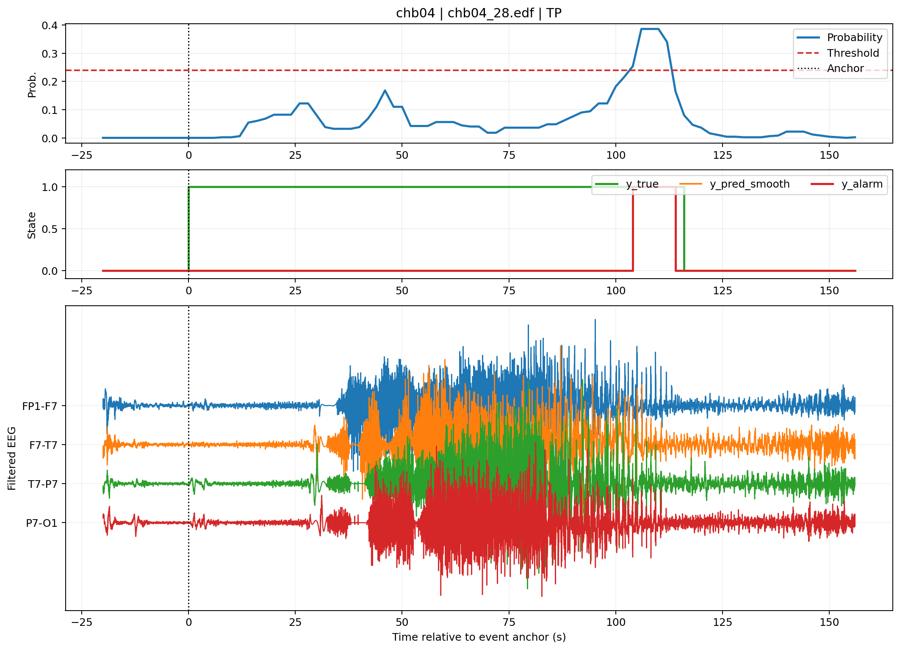

# Clinical Error Analysis (v1-v5)

This directory is a formal part of the reported EE6019 project, not a detached side experiment. It extends the canonical patient-specific Random Forest pipeline with event-level failure analysis and controlled follow-up experiments documented in the final report.

## Why this branch exists

Aggregate seizure-detection metrics do not explain why a detector fails. This branch moves from patient-level summaries to individual events and traces, then uses those failure modes to design and accept or reject targeted changes.

Two recurring cases drove the analysis:

- `chb04`: delayed true-positive behaviour.
- `chb08`: excessive false-positive burden.

The branch retains the same underlying RF pipeline and evaluation logic rather than replacing the project with a separate model family.

## Branch baseline and best accepted result

This refinement branch uses its own reconciled evaluation snapshot. Its numbers should be interpreted relative to that branch baseline rather than mixed directly with the main headline benchmark.

| Variant | Macro sensitivity | Macro FAR / h | Mean delay | Decision |
| --- | ---: | ---: | ---: | --- |
| Reconciled branch baseline | 0.9778 | 0.3907 | 9.96 s | Reference |
| `proxy_augmented_rf` | 0.9778 | 0.2575 | 9.42 s | Best accepted branch result |
| v5 delay-first thresholding | 0.9778 | 1.2423 | - | Rejected: FAR increased sharply |

Representative failure cases:

## Iteration history

| Version | Main question | Outcome |
| --- | --- | --- |
| v1 | What are the dominant clinical failure modes? | Identified delayed-TP and FP-heavy cases; early artifact-aware changes did not generalise safely. |
| v2 | Which component of the apparent improvement is actually useful? | Proxy augmentation emerged as the useful component; aggressive suppression hurt sensitivity. |
| v3 | Can the proxy set be reduced without losing the benefit? | Smaller variants exposed focus-vs-global trade-offs; the hybrid family came close but missed the global guard. |
| v4 | Can one minimal add-back recover the chb04 miss? | Sensitivity recovered, but delay worsened. |
| v5 | Can timing policy fix the delay without increasing false alarms? | Earlier triggering reduced delay but caused unacceptable FAR growth; global threshold lowering was rejected. |

## Global guard

A candidate was not accepted merely because it improved the focus patients. Later iterations required it to avoid new zero-sensitivity patients, limit macro-sensitivity loss, reduce macro FAR, improve chb08 FAR, and avoid worsening chb04 delay.

The strongest accepted improvement across the branch was `proxy_augmented_rf`. Later v4-v5 experiments are retained as useful negative results because they narrow the remaining design problem.

## Evidence navigation

- `reference_notebooks/`: English, output-free v1-v5 historical analysis references.
- `reports/`: written interpretation for each iteration.
- `results/v5/`: final CSV evidence tables and representative case figures.
- `results/v5/global_guard_df.csv`: cohort-level acceptance guard.
- `results/v5/variant_ranking_df.csv`: final variant ranking.

For the primary study benchmark, return to the repository root README and the privacy-redacted final report under `docs/`.
